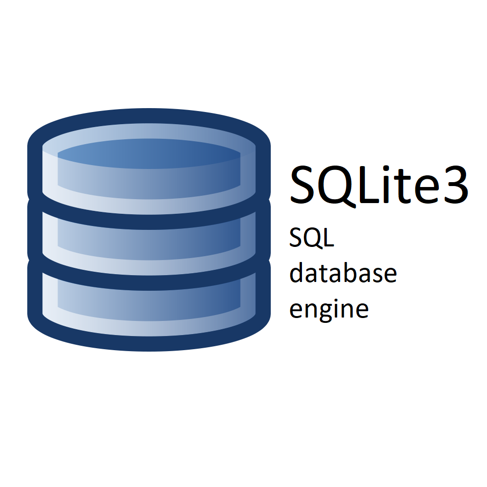

# Documentation

## SQLITE3 DB ARCHITECTURE

## Jupyter Notebooks Usage

Review some about how the connection with the snowflake database is established with this python connector.

[Python Documentation](jupyter/README.md)

## Tables included

| Table | Primary Key |
| ----------- | ----------- |
| Header | Title |

## Sqlite3 Databases Usage

Review some about how the data architecture of this project was created

[Snowflake Documentation](sqlite3/README.md)

## Shell Script Automation

Automate the execution of the various scripts included in this application through the usage of **MAKE GNU**

[Makefile Documentation](makefile/README.md)
